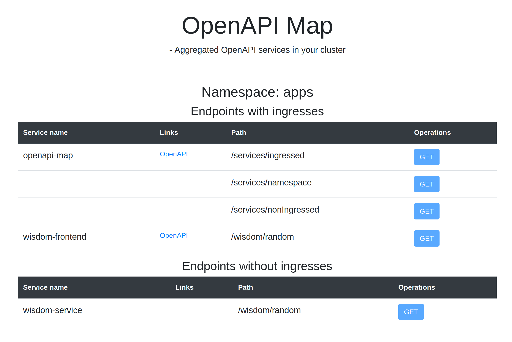

# OpenAPI Map

OpenAPI Map is a kubernetes application that scrapes applications exposing OpenAPI endpoints inside your cluster and aggregates these into a single webpage for a quick overview of you services. From there you can click to the OpenAPI swagger UIs can explore further. 

* **Aggregated view**:
Get an easy overview of the service endpoints in your namespace.
* **Simple config**:
Just configure the namespace it should be looking at.

Built on [Quarkus.io](https://quarkus.io/) and a bit of angular, 

## Getting started

Adjust the namespace in deploy/deployment.yaml:
~~~Shell
kubectl apply -f deploy
~~~

to automatically scrape the services in that namespace. 

## Avoid scraping 

To avoid scraping certain services/ingressses, add the following to your metadata:
~~~Shell
metadata:
  annotations:
    openapi-map/scrape: 'false'
~~~

